# placement-prep

A campus placement preparation platform: the training-and-placement (TNP) cell posts
placement drives, students see only the ones they actually qualify for, and AI features
help them prepare.

## Status

| Feature | State |
| --- | --- |
| Drives board - TNP CRUD and the student eligibility filter | **Built** |
| Applications - a student applying to a drive, and the cell tracking status | **Built** |
| Accounts, login and three-tier roles | **Built** - Spring Security + JWT |
| Web UI - register, sign in, profile, drives board, applications, posting a drive | **Built** |
| Resume upload with AI feedback | Planned - background job queue |
| Q&A over placement notices | Planned - RAG with Spring AI + pgvector |
| Company-wise AI mock interviews | Planned |
| Deadline reminders | Planned - scheduled jobs |

The first TNP account (the person in charge) is seeded by a migration - see
[Signing in as the person in charge](#signing-in-as-the-person-in-charge).

## Stack

**Backend** - Java 21, Maven, Spring Boot 4.1, Spring Web MVC, Spring Security 7, Bean
Validation, Spring Data JPA, Flyway, Actuator, Testcontainers.
**Frontend** - React 19, TypeScript, Vite, Tailwind CSS v4, React Router v7.
**Infrastructure** - PostgreSQL 16 with the pgvector extension, via Docker Compose.

## Request flow

What actually happens between a click in the browser and a row in Postgres, for the
development setup this repository runs (`npm run dev` + `mvnw spring-boot:run` - there is
no production build/deploy story here yet, so the diagram does not invent one):

```mermaid
flowchart LR
    subgraph Browser["Browser"]
        UI["pages/*.tsx\nReact components"]
        API["api/*.ts\none fetch wrapper"]
        UI --> API
    end

    subgraph Vite["Vite dev server · :5173"]
        Proxy["proxies /api and /actuator\nso there is one origin, no CORS"]
    end

    subgraph Spring["Spring Boot · :8081"]
        Filter["JwtAuthenticationFilter\nverifies the signature, loads the caller"]
        Rules["SecurityConfig\nauthorizeHttpRequests - role checks"]
        Controller["Controller\nDTOs in, DTOs out - never an entity"]
        Service["Service\nbusiness rules; Optional/boolean means 'not found'"]
        Repo["Repository\nSpring Data JPA"]
    end

    DB[("PostgreSQL\nschema owned by Flyway")]

    API -->|"fetch('/api/…')\nAuthorization: Bearer token"| Proxy
    Proxy --> Filter
    Filter --> Rules
    Rules -->|"401 no/bad token · 403 wrong role\n- request stops here"| Controller
    Controller --> Service
    Service --> Repo
    Repo --> DB
```



A few things this diagram is being precise about:

- **The token round-trips on every request**, not just at login. `api/client.ts` attaches
  `Authorization: Bearer <token>` to every call; `JwtAuthenticationFilter` verifies the
  signature and re-reads the role from the database rather than trusting the token's
  claim, so a promotion or a revoked account takes effect on the very next request.
- **A 401 or 403 never reaches a controller.** `SecurityConfig`'s rules run first; a
  student hitting a PIC-only endpoint is turned away by the filter chain, and the
  controller method for that endpoint simply never executes.
- **Controllers never see or return an entity.** Everything crossing the browser boundary
  is a DTO, so the database schema (`model/`) and the public API (`dto/`) can change on
  different days without one breaking the other.
- **Services return `Optional`/`boolean`, never a status code.** Deciding that "not found"
  means 404, or that "already exists" means 409, is the controller's job - the same
  service method stays callable from a future scheduled job or CLI command with no web
  request in sight.

## Prerequisites

| Tool | Version |
| --- | --- |
| JDK | 21 |
| Node.js | 24 or newer |
| Docker Desktop | running |

## Quick start

Start the database first - both the backend and its tests need PostgreSQL.

```powershell
docker compose up -d
```

Backend (http://localhost:8081):

```powershell
cd backend
.\mvnw.cmd spring-boot:run
```

Frontend (http://localhost:5173):

```powershell
cd frontend
npm install
npm run dev
```

Open http://localhost:5173, register with a college address, fill in your profile, and the
drives board will show what you qualify for.

### Ports

PostgreSQL is published on host port **5433**, not the usual 5432, and the backend listens
on **8081**, not 8080. Both defaults avoid clashing with software that commonly holds those
ports. Override with the `DB_URL`, `DB_USERNAME`, `DB_PASSWORD` and `SERVER_PORT`
environment variables; the container itself still uses 5432 internally.

### Configuration

Nothing secret is committed. Every value below has a local default that matches
`docker-compose.yml`, and is overridden by an environment variable in a real deployment.

| Variable | Default | Purpose |
| --- | --- | --- |
| `DB_URL` | `jdbc:postgresql://localhost:5433/placementprep` | database connection |
| `DB_USERNAME` / `DB_PASSWORD` | `placementprep` | database credentials |
| `SERVER_PORT` | `8081` | backend port |
| `JWT_SECRET` | a local development placeholder | token signing key |
| `JWT_EXPIRATION` | `86400000` (24 hours) | token lifetime in milliseconds |

`JWT_SECRET` **must** be set to a random private value anywhere real. It is validated at
startup: shorter than 32 characters and the application refuses to boot, naming the
property, rather than failing later inside the signing library.

## Commands

| What | Where | Command |
| --- | --- | --- |
| Start database | root | `docker compose up -d` |
| Stop database | root | `docker compose down` |
| Reset database (deletes data) | root | `docker compose down -v` |
| Run backend tests | `backend/` | `.\mvnw.cmd test` |
| Full backend build + tests | `backend/` | `.\mvnw.cmd verify` |
| Run backend | `backend/` | `.\mvnw.cmd spring-boot:run` |
| Run frontend | `frontend/` | `npm run dev` |
| Build frontend | `frontend/` | `npm run build` |

On macOS or Linux use `./mvnw` instead of `.\mvnw.cmd`.

## Authentication and roles

Login exchanges an email and password for a **JSON Web Token (JWT)**, which the client
then sends on every request as `Authorization: Bearer <token>`.

The token's payload is signed, not encrypted - anyone holding one can read what is inside
it, so nothing confidential goes in a claim. The signature makes it tamper-evident: a
student can read their own role but cannot change it without invalidating the token.

The role travels in the token purely as a convenience for the client. **The server never
trusts it** and re-reads the real role from the database on every request, so a revoked
privilege takes effect on the next call rather than whenever the token happens to expire.

### The three roles

| Role | May do |
| --- | --- |
| `STUDENT` | read the board, see their own eligible drives, edit their own profile, apply to and withdraw from drives |
| `TNP_COORDINATOR` | everything a student may, plus create, edit and delete drives, and review/decide applications |
| `TNP_PIC` | everything a coordinator may, plus promote a student to coordinator |

Registration always creates a `STUDENT`. There is deliberately no role field on the
registration request - if clients could choose, anyone could sign up as staff and publish
fake drives. Coordinators are promoted from existing students by the person in charge
(PIC), and a PIC is seeded directly into the database, because anyone who could grant that
role through the API would already need to hold it.

### College addresses only

Registration is restricted to college email addresses of the form `*@*.nits.ac.in`. A
department subdomain is required, so `name@cse.nits.ac.in` is accepted and the bare
`name@nits.ac.in` is not. The check requires a dot immediately before `nits.ac.in`, which
is what stops a lookalike domain such as `notnits.ac.in` from passing a naive suffix test.

### Signing in as the person in charge

`V8__seed_person_in_charge.sql` inserts the first `TNP_PIC` account directly, so a fresh
database already has someone who can post a drive and promote others - no manual SQL
needed:

| Email | Password |
| --- | --- |
| `tnp@pic.nits.ac.in` | `9676596160` |

This uses the ordinary sign-in form; there is no separate staff login. The stored hash
was generated with this project's own `BCryptPasswordEncoder` and round-trip verified
with `encoder.matches(...)` before being written into the migration, not typed by hand -
a hash that does not actually match its password is a seed account that quietly cannot
log in. That password is a local-development placeholder committed on purpose for this
seed row; it is not meant to guard anything real, which is also why registration itself
stays gated to college addresses rather than accepting arbitrary emails.

A signed-in `TNP_PIC` promotes further students to `TNP_COORDINATOR` through the API:

```sql
-- only needed if you want a second PIC account; coordinators are promoted through
-- POST /api/users/{id}/promote instead, once signed in as the seeded PIC above
UPDATE users SET role = 'TNP_PIC' WHERE email = 'you@cse.nits.ac.in';
```

## API

All paths require `Authorization: Bearer <token>` unless marked public.

### Accounts

| Method | Path | Purpose | Success |
| --- | --- | --- | --- |
| `POST` | `/api/auth/register` | create a student account, returns a token | `201` / `409` |
| `POST` | `/api/auth/login` | exchange credentials for a token | `200` / `401` |
| `GET` | `/api/users/me` | the signed-in user and their profile | `200` |
| `PUT` | `/api/users/me` | replace my academic details | `200` |
| `POST` | `/api/users/{id}/promote` | make a student a coordinator - **PIC only** | `200` / `404` / `409` |

`/api/auth/register` and `/api/auth/login` are public, as is `/actuator/health`.

A failed login is a flat `401` with no detail. Distinguishing "no such account" from
"wrong password" would turn the endpoint into a way to discover which addresses are
registered.

### Profile fields

Sent to `PUT /api/users/me`. All are required, and the eligibility filter needs them
before it can return anything.

| Field | Notes |
| --- | --- |
| `cgpa` | 0-10 |
| `branch` | e.g. `CSE`; stored upper-cased |
| `tenthPercentage`, `twelfthPercentage` | 0-100 |
| `backlogs` | active backlogs; 0 or more |

The response also carries a computed `complete` boolean, so the UI can prompt a student to
finish their profile without re-implementing the same checks.

### Drives

Base path `/api/drives`.

| Method | Path | Purpose | Who | Success |
| --- | --- | --- | --- | --- |
| `GET` | `/api/drives` | all drives, newest first | any signed-in user | `200` |
| `GET` | `/api/drives/eligible` | drives **I** qualify for | any signed-in user | `200` / `409` |
| `GET` | `/api/drives/{id}` | one drive | any signed-in user | `200` / `404` |
| `POST` | `/api/drives` | post a drive | PIC, coordinator | `201` |
| `PUT` | `/api/drives/{id}` | replace a drive | PIC, coordinator | `200` / `404` |
| `DELETE` | `/api/drives/{id}` | remove a drive | PIC, coordinator | `204` / `404` |

`/api/drives/eligible` takes no parameters. It reads the marks from the signed-in user's
own profile, so one student can never enumerate what another would qualify for. It answers
`409` when the caller's profile is not filled in yet.

A drive is returned when **every** condition holds:

- the student meets `cgpaCutoff`, `tenthCutoff` and `twelfthCutoff` - a cutoff left unset
  on the drive imposes no requirement
- the student's branch appears in `eligibleBranches`, matched case-insensitively
- the student has no backlogs, or the drive permits backlogs and the student is within
  `maxBacklogs`
- `applicationDeadline` has not passed

Results are ordered by deadline, soonest first.

### Drive fields

| Field | Required | Notes |
| --- | --- | --- |
| `companyName`, `role` | yes | non-blank |
| `ctc` | yes | positive, in rupees per annum |
| `tier` | yes | |
| `cgpaCutoff` | yes | minimum CGPA |
| `tenthCutoff`, `twelfthCutoff` | no | minimum percentage, 0-100. Omit to set no requirement |
| `backlogsAllowed` | yes | whether students with active backlogs may apply |
| `maxBacklogs` | only when `backlogsAllowed` is true | how many are tolerated; omit for no ceiling |
| `eligibleBranches` | yes | non-empty list, e.g. `["CSE","ECE"]` |
| `applicationDeadline` | yes | ISO-8601 instant |
| `description` | no | free text |

Example, as a coordinator:

```powershell
curl.exe -X POST http://localhost:8081/api/drives `
  -H "Authorization: Bearer $token" -H "Content-Type: application/json" -d '{
  \"companyName\": \"Zoho Corporation\", \"role\": \"Member Technical Staff\",
  \"ctc\": 900000, \"tier\": 1, \"cgpaCutoff\": 7.5,
  \"tenthCutoff\": 75.0, \"twelfthCutoff\": 70.0,
  \"backlogsAllowed\": false,
  \"eligibleBranches\": [\"CSE\", \"ECE\", \"IT\"],
  \"applicationDeadline\": \"2026-12-20T18:00:00Z\"}'
```

### Applications

Base path `/api/applications`.

| Method | Path | Purpose | Who | Success |
| --- | --- | --- | --- | --- |
| `POST` | `/api/applications` | apply to a drive | any signed-in user | `201` / `409` |
| `GET` | `/api/applications/me` | my own applications | any signed-in user | `200` |
| `GET` | `/api/applications/drive/{driveId}` | everyone who applied to a drive | PIC, coordinator | `200` |
| `PATCH` | `/api/applications/{id}/status` | move an application along | PIC, coordinator | `200` / `404` |
| `POST` | `/api/applications/{id}/withdraw` | pull out of a drive | any signed-in user | `200` / `404` |

`POST /api/applications` takes only `{"driveId": ...}` - the student comes from the
signed-in account, never from the body, so nobody can apply on someone else's behalf.
Applying twice to the same drive is a `409`, backed by a real `UNIQUE (student_id,
drive_id)` constraint in the database, not just an application-level check. That
uniqueness also means **withdrawing is final**: it sets status to `WITHDRAWN` rather than
deleting the row, so a later `POST` to the same drive still finds that row and still
answers `409` - there is no re-apply path once withdrawn.

Status is one of `APPLIED`, `SHORTLISTED`, `REJECTED`, `SELECTED`, `WITHDRAWN`. A student
can reach `APPLIED` (by applying) and `WITHDRAWN` (by withdrawing) and nothing else;
every other transition is the placement cell's call through `PATCH .../status`.

Withdrawing someone else's application answers `404`, not `403` - `ApplicationService`
looks the row up by `(id, studentId)` together, so a guessed id that belongs to another
student simply does not match, and the response never confirms that an application with
that id exists at all.

### Errors

Every error is [RFC 9457 Problem Details](https://www.rfc-editor.org/rfc/rfc9457) JSON, so
one client-side handler covers the whole API. A body-validation failure also names the
offending fields:

```json
{
  "title": "Bad Request",
  "status": 400,
  "detail": "Invalid request content.",
  "instance": "/api/auth/register",
  "errors": { "email": "Registration is open only to college email addresses ending in .nits.ac.in" }
}
```

The rejected value is deliberately never echoed back, since on a registration form the
submitted body contains a password.

## Layout

```
placement-prep/
├── backend/                Spring Boot API (Java 21, Maven)
│   └── src/main/java/com/rishikesh/placementprep/
│       ├── common/             Shared building blocks and validation error handling
│       ├── infrastructure/
│       │   └── security/       Filter chain, JWT filter, rule config, error handlers
│       └── modules/
│           ├── auth/           Accounts, login, roles, JWT            (built)
│           ├── drive/          Placement drives and eligibility       (built)
│           │   ├── controller/ HTTP endpoints
│           │   ├── service/    Business logic
│           │   ├── repository/ Spring Data JPA interfaces
│           │   ├── model/      JPA entities
│           │   └── dto/        Request and response records
│           ├── application/    A student applying, and its status     (built)
│           ├── resume/         Resume uploads and AI feedback         (planned)
│           ├── knowledgebase/  RAG over placement notices             (planned)
│           ├── interview/      AI mock interviews                     (planned)
│           └── notification/   Deadline reminders                     (planned)
├── frontend/               React + TypeScript single-page app (Vite)
│   └── src/
│       ├── api/                Functions that call the backend
│       ├── components/         Reusable presentational pieces
│       └── pages/              Login, Register, Profile, Drives,
│                                Applications, PostDrive
└── docker-compose.yml      PostgreSQL with the pgvector extension
```

Every module gets the same five sub-packages as it grows. Controllers accept and return
DTOs, never entities, so the database schema and the public API stay free to change
independently. Services return `Optional` or `boolean` to mean "not found" and never
import a web type, which keeps them callable from a scheduled job or a queue consumer.

## Database

The schema is owned by Flyway. Hibernate runs with `ddl-auto: validate` and will never
create or alter a table. Every schema change is a new migration in
`backend/src/main/resources/db/migration/`; an applied migration is never edited, because
Flyway stores a checksum of each file and refuses to start if one changes.

| Migration | Adds |
| --- | --- |
| `V1__enable_pgvector.sql` | the `vector` extension, for the later RAG feature |
| `V2__create_drives_table.sql` | the `drives` table |
| `V3__add_eligibility_criteria_to_drives.sql` | 10th and 12th cutoffs, backlogs allowed flag |
| `V4__add_max_backlogs_to_drives.sql` | backlog ceiling |
| `V5__create_users_table.sql` | the `users` table |
| `V6__add_student_profile_to_users.sql` | CGPA, branch, school percentages, backlogs |
| `V7__update_user_roles.sql` | splits the single TNP role into coordinator and PIC |
| `V8__seed_person_in_charge.sql` | inserts the first `TNP_PIC` account, hash pre-verified |
| `V9__create_applications_table.sql` | the `applications` table, with real foreign keys into `users` and `drives` |

## Testing

```powershell
cd backend
.\mvnw.cmd test
```

81 integration tests. They run against a real PostgreSQL container started by
Testcontainers using the `pgvector/pgvector:pg16` image, so **Docker must be running**.
Nothing is mocked and no test touches the development database. New integration tests
should import `TestcontainersConfiguration` rather than pointing at a hand-managed
database.

The suite generates real signed tokens rather than stubbing the security context, so the
JWT filter and the authorisation rules are genuinely exercised - including the cases that
matter most, such as a student being refused a write and a coordinator being refused a
promotion.

## Notes

- The frontend dev server proxies `/api` and `/actuator` to the backend, so there is no
  CORS configuration anywhere.
- The token is held in `localStorage`. That is readable by any script on the page, so it
  trades some XSS exposure for not needing CSRF protection on a cookie; a production
  deployment would likely move to an httpOnly cookie and add CSRF tokens.
- Sessions are stateless - no `HttpSession` is ever created, so any instance can serve any
  request without shared session storage.
